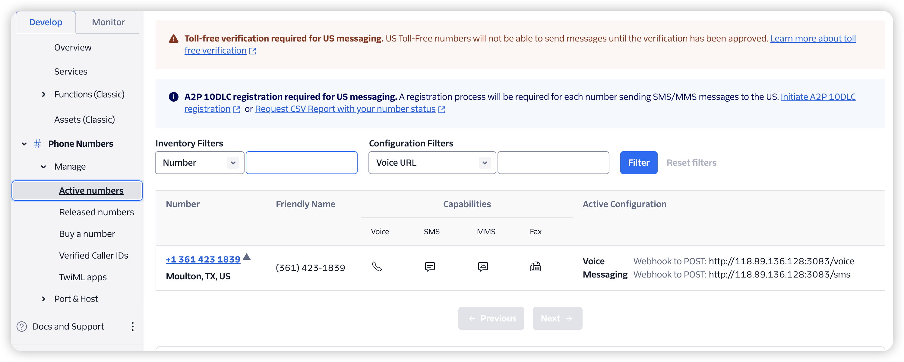
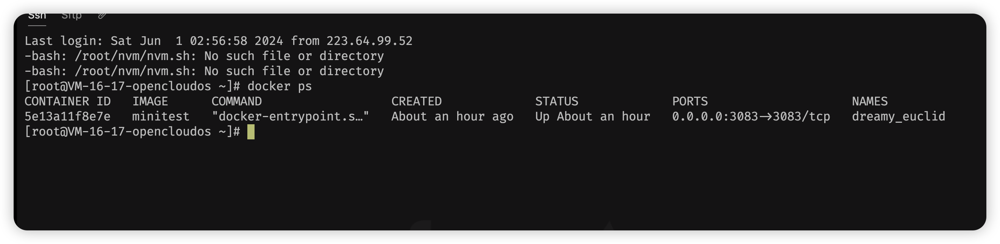
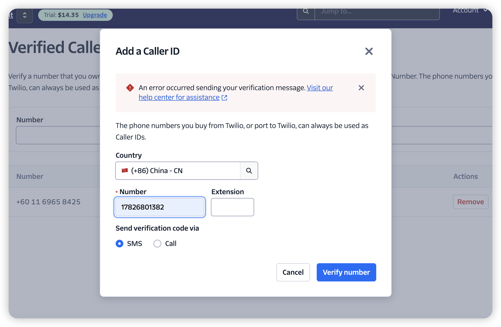

minitest
我们需要通过通话和短信的⽅式来获取/更新以下⽤户状态：
1.用户电话 2.用户姓名 3.职业 4.居住地 5.性别 6.是否结婚  7.爱好 8.喜欢的食物 9.使用的手机型号 10.最近的旅行计划 11.常去的国家

按下面实现步骤：
1. ⾸先熟悉这个twilio与openai对接的教程 （https://www.twilio.com/enus/blog/integrate-openai-chatgpt-twilio-programmable-voice-functions）
2. 这⾥我们不⽤twilio⾃带的部署，但⽤node.js 来在本地部署两个endpoints 分别对应
respond.js 和speak.js
3. 数据库建⼀张表Users:
id: number
phone: number
collection: string(包含如下信息)
1. ⽤户电话
2. ⽤户姓名
3. 职业
4. 居住地
5. 性别
6. 是否结婚
7. 爱好
8. 喜欢的⾷物
9. 使⽤的⼿机型号
10. 最近的旅⾏计划
11. 常去的国家

实现的功能：
1. user calls
2. 创建⼀个user，⽬标是和⽤户对话并采访问题1到8并跟新数据库collection
3. 通话结束后⽴即⾃动发送⼀个sms给user的电话号码，⽬标是采访问题9，10，11并跟新数据库collection

twilio配置：
 

docker服务：
 

配置ok 服务ok 暂时我的手机号add caller 加不上去 如图：
 

